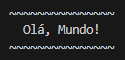

# [Mundo 3: Estruturas Compostas](https://www.youtube.com/playlist?list=PLHz_AreHm4dksnH2jVTIVNviIMBVYyFnH)

## Desafio 072

Crie um programa que tenha uma tupla totalmente preenchida com uma contagem por extenso, de zero até vinte.

Seu programa deverá ler um número pelo teclado (entre 0 e 20) e mostrá-lo por extenso.

</br>

## Desafio 073

Crie um tupla preenchida com os 20 primeiros colocados da Tabela do Campeonato Brasileiro de Futebol, na ordem de colocação. Depois mostre:

A) Os 5 primeiros.

B) Os últimos 4 colocados.

C) Times em ordem alfabética.

D) Em que posição está o time da Chapecoense.

</br>

## Desafio 074

Crie um programa que vai gerar cinco números aleatórios e colocar em uma tupla. Depois disso, mostre a listagem de números gerados e também indique o menor e o maior valor que estão na tupla.

</br>

## Desafio 075

Desenvolva um programa que leia quatro valores pelo teclado e guarde-os em uma tupla. No final, mostre:

A) Quantas vezes apareceu o valor 9.

B) Em que posição foi digitado o primeiro valor 3.

C) Quais foram os números pares.

</br>

## Desafio 076

Crie um programa que tenha uma tupla única com nomes de produtos e seus respectivos preços, na sequência. No final, mostre uma listagem de preços, organizando os dados em forma tabular.

</br>

## Desafio 077

Crie um programa que tenha uma tupla com várias palavras (não usar acentos). Depois disso, você deve mostrar, para cada palavra, quais são as suas vogais.

</br>

## Desafio 078

Faça um programa que leia 5 valores numéricos e guarde-os em uma lista. No final, mostre qual foi o maior e o menor valor digitado e as suas respectivas posições na lista.

</br>

## Desafio 079

Crie um programa onde o usuário possa digitar vários valores numéricos e cadastre-os em uma lista. Caso o número já exista lá dentro, ele não será adicionado. No final, serão exibidos todos os valores únicos digitados em ordem crescente.

</br>

## Desafio 080

Crie um programa onde o usuário possa digitar cinco valores numéricos e cadastre-os em uma lista, já na posição correta de inserção (sem usar o `sort()`). No final, mostre a lista ordenada na tela.

</br>

## Desafio 081

Crie um programa que vai ler vários números e colocar em uma lista. Depois disso, mostre:

A) Quantos números foram digitados.

B) A lista de valores, ordenada de forma decrescente.

C) Se o valor 5 foi digitado e está ou não na lista.

</br>

## Desafio 082

Crie um programa que vai ler vários números e colocar em uma lista. Depois disso, crie duas listas extras que vão conter apenas os valores pares e os valores ímpares digitados, respectivamente. Ao final, mostre o conteúdo das três listas geradas.

</br>

## Desafio 083

Crie um programa onde o usuário digite um expressão qualquer que use parênteses. Seu aplicativo deverá analisar se a expressão passada está com os parêntes abertos e fechados na ordem correta.

</br>

## Desafio 084

Faça um programa que leia nome e peso de várias pessoas, guardando tudo em uma lista. No final, mostre:

A) Quantas pessoas foram cadastradas.

B) Uma listagem com as pessoas mais pesadas.

C) Uma listagem com as pessoas mais leves.

</br>

## Desafio 085

Crie um programa onde o usuário possa digitar sete valores numéricos e cadastre-os em uma lista única que mantenha separados os valores pares e ímpares. No final, mostre os valores pares e ímpares em ordem crescente.

</br>

## Desafio 086

Crie um programa que crie uma matriz de dimensão 3x3 e preencha com valores lidos pelo teclado.

No final, mostre a matriz na tela, com a formatação correta.

</br>

## Desafio 087

Aprimore o desafio anterior, mostrando no final:

A) A soma de todos os valores pares digitados.

B) A soma dos valores da terceira coluna.

C) O maior valor da segunda linha.

</br>

## Desafio 088

Faça um programa que ajude um jogador da MEGA SENA a criar palpites. O programa vai perguntar quantos jogos serão gerados e vai sortear 6 números entre 1 e 60 para cada jogo, cadastrando tudo em uma lista composta.

</br>

## Desafio 089

Crie um programa que leia o nome e duas notas de vários alunos e guarde tudo em uma lista composta. No final, mostre o boletim contendo a média de cada um e permita que o usuário possa mostrar as notas de cada aluno individualemente.

</br>

## Desafio 090

Faça um programa que leia nome e média de um aluno, guardando também a situação em um dicionário. No final, mostre o conteúdo da estrutura na tela.

</br>

## Desafio 091

Crie um programa onde 4 jogadores joguem um dado e tenham resultados aleatórios. Guarde eses resultados em um dicionário. No final, coloque esse dicionário em ordem, sabendo que o vencedor tirou o maior número do dado.

</br>

## Desafio 092

Crie um programa que leia nome, ano de nascimento e carteira de trabalho e cadastre-os (com idade) em um dicionário se por acaso a CTPS for diferente de ZERO, o dicionário receberá também o ano de contratação e o salário. Calcule e acrescente, além da idade, com quantos anos a pessoa vai se aposentar.

</br>

## Desafio 093

Crie um programa que gerencie o aproveitamento de um jogador de futebol. O programa vai ler o nome do jogador e quantas partidas ele jogou. Depois vai ler a quantidade de gols feitos em cada partida. No final, tudo isso será guardado em um dicionário, incluindo o total de gols feitos durante o campeonato.

</br>

## Desafio 094

Crie um programa que leia nome, sexo e idade de várias pessoas, guardando os dados de cada pessoa em um dicionário e todos os dicionários em uma lista. No final, mostre:

A) Quantas pessoas foram cadastradas

B) A média de idade.

C) Uma lista com mulheres.

D) Uma lista com idade acima da média.

</br>

## Desafio 095

Aprimore o DESAFIO 093 para que ele funcione com vários jogadores, incluindo um sistema de visualização de detalhes do aproveitamento de cada jogador.

</br>

## Desafio 096

Faça um programa que tenha uma função chama `área()`, que receba as dimensões de um terreno retangular (largura e comprimento) e mostre a área do terreno.

</br>

## Desafio 097

Faça um programa que tenha uma função chamada `escreva()`, que receba um texto qualquer como parâmetro e mostre uma mensagem com tamanho adaptável.

Ex:

`escreva('Olá, Mundo!')`

Saída:



</br>

## Desafio 098

Faça um programa que tenha uma função chamada `contador()`, que receba três parâmentros: início, fim e passo.Seu programa tem que realizar três contagens através da função criada:

a) De 1 até 10, de 1 em 1

b) De 10 até 0, de 2 em 2

c) Uma contagem personalizada.

</br>

## Desafio 099

Faça um programa que tenha uma função chamada `maior()`, que receba vários parâmetros com valores inteiros. Seu programa tem que analisar todos os valores e dizer qual deles é o maior.

</br>

## Desafio 100

Faça um programa que tenha uma lista chamada números e duas funções chamadas `sorteia()` e `somaPar()`. A primeira função vai sortear 5 números e vai colocá-los dentro da lista e a segunda função vai mostrar a soma entre todos os valores PARES sorteados pela função anterior.

</br>

## Desafio 101

Crie um programa que tenha uma função chamada `voto()` que vai receber como parâmetro o ano de nascimento de uma pessoa, retornando um valor literal indicando se uma pessoa tem voto NEGADO, OPCIONAL ou OBRIGATÓRIO nas eleições.

</br>

## Desafio 102

Crie um programa que tenha uma função `fatorial()` que receba dois parâmentros: o primeiro que indique o número a calcular e o outro chamado show, que será um valor lógico (opcional) indicando se será mostrado ou não na tela o processo de cálculo do fatorial.

</br>

## Desafio 103

Faça um programa que tenha uma função chamada `ficha()`, que receba dois parâmetros opcionais: o nome de um jogador e quantos gols ele marcou. O programa deverá ser capaz de mostrar a ficha do jogador, mesmo que algum dado não tenha sido informado corretamente.

</br>

## Desafio 104

Crie um programa que tenha a função `leiaInt()`, que vai funcionar de forma semelhante à função `input()` do Python, só fazendo a validação para aceitar apenas um valor numérico.

Ex:

```py
n = leiaInt('Digite um n')
```

</br>

## Desafio 105

Faça um programa que tenha uma função `notas()` que pode receber várias notas de alunos e vai retornar um dicionário com as seguintes informações:

- Quantidade de notas
- A maior nota
- A menor nota
- A média da turma
- A situação (opcional)

Adicione também as docstrings.

</br>

## Desafio 106

Faça um um mini-sistema que utilize o Interavive Help do Python. O usuário vai digitar o comando e o manual vai aparecer. Quando o usuário digitar a palavra 'FIM', o programa se encerrará.

OBS: use cores.

</br>

## Desafio 107

Crie um módulo chamado moeda.py que tenha as funções incorporadas `aumentar()`, `diminuir()`, `dobro()` e `metade()`. Faça também um programa que importe esse módulo e use algumas dessas funções.

</br>

## Desafio 108

Adapte o código do desafio 107, criando uma função adicional chamada `moeda()` que consiga mostrar os valores como um valor monetário formatado.

</br>

## Desafio 109

Modifique as funções que foram criadas no desafio 107 para que elas aceitem um parâmetro a mais, informando se o valor retornado por elas vai ser ou não formatado pela função `moeda()`, desenvolvida no desafio 108.

</br>

## Desafio 110

Adicione ao módulo moeda.py criado nos desafios anteriores, uma função chamada `resumo()`, que mostre na tela algumas informações geradas pelas funções que já temos no módulo criado até aqui.

</br>

## Desafio 111

Crie um pacote chamado utilidadesCeV que tenha dois módulos internos chamados moeda e dado.

Transfira todas as funções utilizadas nos desafios 107, 108 e 109 para o primeiro pacote e mantenha tudo funcionando.

</br>

## Desafio 112

Dentro do pacote utilidadesCeV que criamos no desafio 111, temos um módulo chamado dado. Crie uma função chamada `leiaDinheiro()` que seja capaz de funcionar como a função `input()`, mas com a validação de dados para aceitar apenas valores que sejam monetários.

</br>

## Desafio 113

Reescreva a função `leiaInt()` que fizemos no desafio 104, incluindo agora a possibilidade da digitação de um número de tipo inválido. Aproveite e crie também uma função `leiaFloat()` com a mesma funcionalidade.

</br>

## Desafio 114

Crie um código em Python que teste se o site Pudim está acessível pelo computador usado.

</br>

## Desafio 115 (Extra)

Crie um pequeno sistema modularizado que permita cadastrar pessoas pelo seu nome e idade em um arquivo de texto simples.

O sistema só vai ter 2 opções: cadastrar uma nova pessoa e listar todas as pessoas cadastradas.
